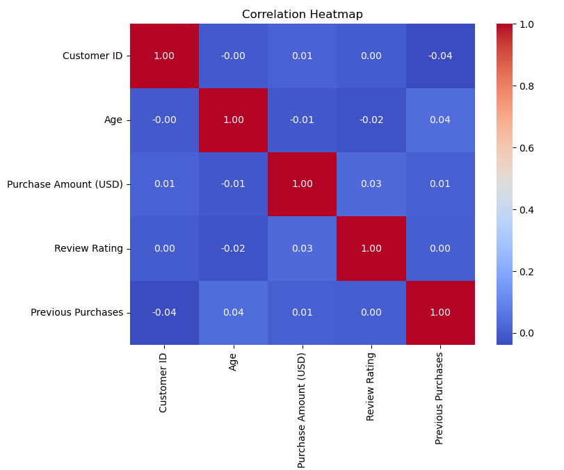

# 🛍️ Shopping Behaviour Analysis  

This project focuses on analyzing customer shopping behavior using Python libraries such as **Pandas**, **NumPy**, **Matplotlib**, and **Seaborn**.  
The notebook covers importing, cleaning, analyzing, and visualizing shopping data with **18 different plots** for insights.  

---

## 📂 Project Structure
- `Shooping Behaviour Analysis.ipynb` → Main Jupyter Notebook with analysis
- `Shooping behaviour updated.csv` → Dataset
- `Pic0.png, Pic3.png, Pic6.png, Pic7.png, Pic10.png` → Key visualizations  

---

## 🚀 Features
✔ Data Cleaning and Preprocessing  
✔ Exploratory Data Analysis (EDA)  
✔ Visualization of purchase patterns  
✔ Insights on categories, payment methods, and seasonal trends  

---
## Project cover image

  

## 📊 Sample Visualizations  

### 1. Share of Purchases by Category  
  

### 2. Average Purchase by Category  
  

### 3. Purchase Count by Subscription Status & Payment Method  
  

### 4. Purchases by Item, Location, and Season  
  

### 5. Total Purchase Amount by Location
  

### 6. Number of Review Ratings by Gender
  

### 7. Correlation Heatmap
  

### 8. Number of Items per Category


### 9. Share of Purchases by Gender


---

## 🔧 Technologies Used
- Python  
- Pandas  
- NumPy  
- Matplotlib  
- Seaborn  
- Plotly  

---

## 📌 How to Run
1. Clone the repository:  
   ```bash
   git clone https://github.com/yourusername/shopping-behaviour-analysis.git
2. Open Jupyter Notebook:
   jupyter notebook "Shooping Behaviour Analysis.ipynb"
3.un all cells to reproduce the analysis.

## 📈 Insights

Clothing makes up the largest share of purchases.

Average purchase amount across categories is similar, but Footwear slightly leads.

Non-subscribers purchase more frequently compared to subscribers.

Seasonal & location-based trends highlight regional shopping preferences.

## 🤝 Contributing
Pull requests are welcome.
